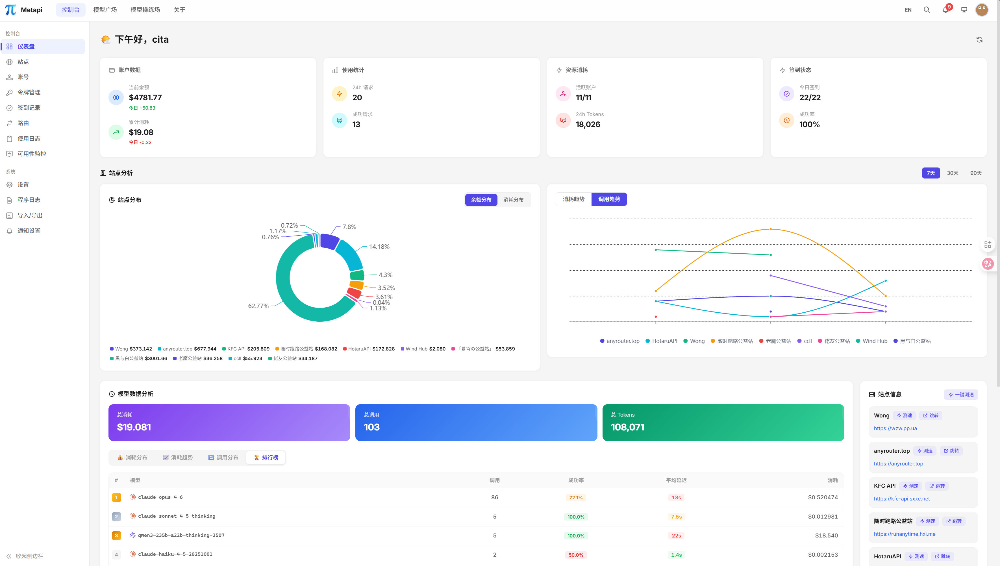
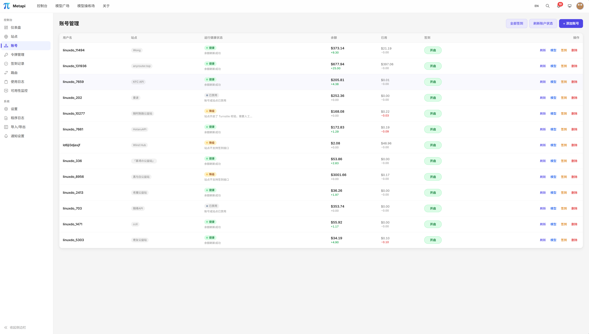

<div align="center">


**中转站的中转站 - 将分散的 AI 中转站聚合为一个统一网关**

<p>
把你在各处注册的 New API / One API / OneHub / DoneHub / Veloera / AnyRouter / Sub2API 等站点，
<br>
汇聚成 <strong>一个 API Key、一个入口</strong>，自动发现模型、智能路由、成本最优。
</p>

<p align="center">
<a href="https://github.com/cita-777/metapi/releases">
  
</a><!--
--><a href="https://github.com/cita-777/metapi/stargazers">
  
</a><!--
--><a href="https://deepwiki.com/cita-777/metapi">
  
</a><!--
--><a href="https://hub.docker.com/r/1467078763/metapi">
  
</a><!--
--><a href="https://hub.docker.com/r/1467078763/metapi">
  
</a><!--
--><a href="LICENSE">
  
</a><!--
--><!--
--><!--
--><a href="https://zeabur.com/templates/DOX5PR">
  
</a><!--
--><a href="https://render.com/deploy?repo=https://github.com/cita-777/metapi">
  
</a>
</p>

<p align="center">
  <a href="README.md"><strong>中文</strong></a> |
  <a href="README_EN.md">English</a>
</p>

<p align="center">
  <a href="https://metapi.cita777.me"><strong>📚 在线文档</strong></a> ·
  <a href="https://metapi.cita777.me/getting-started">快速上手</a> ·
  <a href="https://metapi.cita777.me/deployment">部署指南</a> ·
  <a href="https://metapi.cita777.me/configuration">配置说明</a> ·
  <a href="https://metapi.cita777.me/client-integration">客户端接入</a> ·
  <a href="https://metapi.cita777.me/faq">常见问题</a>
</p>

</div>

---

## 🍴 关于本 Fork

本仓库是 [cita-777/metapi](https://github.com/cita-777/metapi) 的增强版 Fork，主页默认以本 Fork 的真实能力为准。

- **自定义功能**：Token 级模型管理、站点健康与模型探活增强、路由健康度管理等
- **上游新功能**：挑选并合并上游已合并但尚未发版的新 PR
- **自定义文档**：设计取舍、迁移记录和补充说明统一收敛在 `docs/custom/`

> 📖 详细文档见 [docs/custom/README.md](docs/custom/README.md)

---

## 🌐 在线体验

> 无需部署，直接体验 Metapi 的完整功能：

|                        |                                                            |
| ---------------------- | ---------------------------------------------------------- |
| 🔗 **体验地址** | [metapi-t9od.onrender.com](https://metapi-t9od.onrender.com/) |
| 🔑 **管理员令牌** | `123456` |

> **⚠️ 安全提示**：体验站为公共环境，**请勿填入你的 API Key、账号密码或站点信息**。数据随时可能被清空。

> **ℹ️ 说明**：体验站使用 Render 免费方案 + OpenRouter 免费模型（仅 `:free` 后缀的模型可用）。

---

## 🎯 自定义功能（本 Fork 独有）

| 特性 | 说明 |
|------|------|
| **端点协议覆盖** | 三层级联（token > account > site），精确控制上游走 chat / messages / responses 哪条协议 |
| **协议亲和性学习** | 代理运行时自动学习各站点支持的协议，跳过不可用端点并修正统计口径 |
| **Responses 自动降级** | `/v1/responses` 遇到 403 blocked 自动降级到 `/v1/chat/completions` |
| **Token 级模型管理** | 每个 API Token 可独立配置可用模型列表，支持白名单/黑名单模式 |
| **令牌级模型映射** | 令牌级别独立配置模型映射，候选支持站点过滤 |
| **账号级模型映射** | 账号维度独立配置模型映射，与路由系统集成 |
| **站点级模型过滤** | 支持站点维度的模型白名单/黑名单 |
| **模型过滤系统** | 站点批量禁用、全局品牌过滤、路由状态过滤、通道站点屏蔽快捷操作 |
| **站点健康中心** | 统一查看最近成功/失败、相对时间、模型与 HTTP 摘要；支持悬停查看详情，并可一键跳转该站点最近 24 小时使用日志 |
| **站点被动健康信号** | 从代理日志中自动提取健康信号，无需主动探测即可感知站点状态 |
| **模型探活增强** | 支持单通道/批量探活、批次间隔配置、反风控优化（随机真实 prompt），并复用连接管理里的探活弹窗执行手动探活 |
| **探活排序一键应用** | route 级一键应用探活结果；明确故障沉底，健康通道按 TTFT 分档加权，`跳过/未知` 保留当前优先级 |
| **通道优先级/权重** | 手动配置通道优先级与权重；探活排序自动设置 weight（快 200 / 正常 100 / 慢 30），主要作用于 `weighted` / `stable_first`，`round_robin` 仍按轮询顺序 |
| **路由健康度管理** | 通道级冷却重置、站点惩罚 DB 同步、WebUI 可视化 |
| **下游密钥站点排除** | 下游 API Key 支持站点和凭证级别的黑名单排除 |
| **福利账号凭证路由** | 支持福利账号主凭证直接绑定路由通道 |
| **全选/反选控件** | 站点、模型和路由配置面板支持全选与反选快捷操作 |
| **账号/站点排序置顶** | 支持拖拽排序和置顶操作，快速定位常用资源 |
| **管理 IP 白名单** | 管理面板显示当前识别 IP，支持白名单动态更新 |
| **登录会话延长** | 会话有效期延长至 30 天 |
| **安全加固** | 剥离上游 IP 泄漏请求头 |

---

## 🚀 上游新功能（已合并尚未发版）

以下功能来自上游已合并的 PR，因作者尚未发版，提前挑选合并：

| PR | 功能 | 说明 |
|----|------|------|
| **#330** | 主动探活 + 负载感知路由 | 四态探测、`stable_first` 主池/观察池、自动恢复探测 |
| **#365** | 路由冷却控制 | 可配置冷却上限、route 级批量清冷却 |
| **#383** | 首字节超时 | 更快甩掉无响应链路，不误伤已输出流 |
| **#400/#410** | SQLite 迁移修复 | 迁移日志恢复 + 重试次数上限，防止启动死循环 |
| **#404** | Codex Responses 跨通道续接 | 修复 Responses 续接 roundtrip 路径缺失 |
| **#422/#439** | 上游透传头收紧 | 收紧通用透传头 + Codex compact 非流式 Accept 头修正 |
| **#426** | Responses compact fallback | 运行时开关，compact 失败自动回退 |
| **#429** | 下游客户端检测收紧 | 精确识别 Cursor/Claude Code/Codex 等客户端 |
| **#431** | 下游 Key 排除规则 | 支持站点和凭证级别的排除策略 |
| **#433** | OAuth 配额与代理控制 | OAuth 连接配额 UI + 代理保存流程优化 |
| **#440** | OAuth 路由池 | OAuth 路由池和代理保存流程 |
| **#441** | Sub2API managed refresh | 提升订阅制平台凭证刷新韧性 |
| **#444** | Antigravity special-model | 对齐非流式路径 |
| **#450** | OAuth 路由删除修复 | OAuth 路由单元删除回滚修复 |
| **#457** | 管理快照优先读取 | 管理页面使用快照优先读取，提升响应速度 |
| **#464** | LobeHub 品牌检测 | 扩展 brand 识别覆盖率 |
| **#471** | MySQL 聚合修复 | 防止 MySQL 使用量聚合导致启动崩溃 |
| **#473/#474** | Payload Rules 设置 UI | 管理面板可视化配置请求载荷规则 |

---

## 📖 介绍

现在 AI 生态里有越来越多基于 New API / One API 系列的聚合中转站，要管理多个站点的余额、模型列表和 API 密钥，往往既分散又费时。

**Metapi** 作为这些中转站之上的**元聚合层（Meta-Aggregation Layer）**，把多个站点统一到 **一个入口（可按项目配置多个下游 API Key）**。下游所有工具（Cursor、Claude Code、Codex、Open WebUI 等）即可无感接入全部模型。当前已支持以下上游平台：

- [New API](https://github.com/QuantumNous/new-api)
- [One API](https://github.com/songquanpeng/one-api)
- [OneHub](https://github.com/MartialBE/one-hub)
- [DoneHub](https://github.com/deanxv/done-hub)
- [Veloera](https://github.com/Veloera/Veloera)
- [AnyRouter](https://anyrouter.top) - 通用路由平台
- [Sub2API](https://github.com/Wei-Shaw/sub2api) - 订阅制中转

| 痛点                                  | Metapi 怎么解决                                                        |
| ------------------------------------- | ---------------------------------------------------------------------- |
| 🔑 每个站点一个 Key，下游工具配置一堆 | **统一代理入口 + 可选多下游 Key 策略**，模型自动聚合到 `/v1/*` |
| 💸 不知道哪个站点用某个模型最便宜     | **智能路由** 自动按成本、余额、使用率选最优通道 |
| 🔄 某个站点挂了，手动切换好麻烦       | **自动故障转移**，一个通道失败自动冷却并切到下一个 |
| 📊 余额分散在各处，不知道还剩多少     | **集中看板** 一目了然，余额不足自动告警 |
| ✅ 每天得去各站签到领额度             | **自动签到** 定时执行，奖励自动追踪 |
| 🤷 不知道哪个站有什么模型             | **自动模型发现**，上游新增模型零配置出现在你的模型列表里 |

---

## 🖼️ 界面预览

<table>
  <tr>
    <td align="center">
      
      <div><b>仪表盘</b> - 余额分布、消费趋势、系统概览</div>
    </td>
    <td align="center">
      
      <div><b>模型广场</b> - 跨站模型覆盖、定价对比、实测指标</div>
    </td>
  </tr>
  <tr>
    <td align="center">
      
      <div><b>智能路由</b> - 多通道概率分配、成本优先选路</div>
    </td>
    <td align="center">
      
      <div><b>账号管理</b> - 多站点多账号、健康状态追踪</div>
    </td>
  </tr>
  <tr>
    <td align="center">
      
      <div><b>站点管理</b> - 上游站点配置与状态一览</div>
    </td>
    <td align="center">
      
      <div><b>令牌管理</b> - API Token 生命周期管理</div>
    </td>
  </tr>
  <tr>
    <td align="center">
      
      <div><b>模型操练场</b> - 在线交互式模型测试</div>
    </td>
    <td align="center">
      
      <div><b>签到记录</b> - 自动签到状态与奖励追踪</div>
    </td>
  </tr>
  <tr>
    <td align="center">
      
      <div><b>使用日志</b> - 代理请求日志与成本明细</div>
    </td>
    <td align="center">
      
      <div><b>可用性监控</b> - 通道健康度实时监测</div>
    </td>
  </tr>
  <tr>
    <td align="center">
      
      <div><b>系统设置</b> - 全局参数与安全配置</div>
    </td>
    <td align="center">
      
      <div><b>通知设置</b> - 多渠道告警与推送配置</div>
    </td>
  </tr>
</table>

---

## 🏛️ 架构概览

<div align="center">
  
</div>

---

## ✨ 核心功能

### 🌐 统一代理网关

- 兼容 **OpenAI** 与 **Claude** 下游格式，对接所有主流客户端
- 支持 Responses / Chat Completions / Messages / Completions（Legacy）/ Embeddings / Images / Models，以及标准 `/v1/files` 文件接口
- 完整的 SSE 流式传输支持，自动格式转换（OpenAI ⇄ Claude）

### 🧠 智能路由引擎

- 自动发现所有上游站点的可用模型，**零配置**生成路由表
- 四级成本信号：**实测成本 -> 账号配置成本 -> 目录参考价 -> 默认兜底**
- 多通道概率分摊，基于成本（40%）、余额（30%）、使用率（30%）加权分配
- 支持 route 级一键“探活整队”：明确故障通道自动沉底，成功通道按 TTFT 自动映射权重，`跳过/未知` 保持当前顺序
- 失败通道自动冷却与避让（可配置冷却上限）
- 请求失败自动重试，自动切换其他可用通道
- 路由决策可视化解释，每次选择透明可审计

### 🩺 站点健康与探活管理（本 Fork 增强）

- 底层探活 raw status 仍保持四态：`supported` / `unsupported` / `inconclusive` / `skipped`
- WebUI 会派生展示为四类健康结果：`成功 / 失败 / 跳过 / 未知`，路由卡片摘要、通道 badge 和应用排序使用同一套规则
- 手动探活直接复用连接管理里的探活弹窗，并沿用站点现有模型黑/白名单筛选逻辑
- 站点健康页会展示最近成功与最近失败，默认按最近成功排序，并同时显示绝对时间与“距今多久”
- 最近成功摘要会展示模型、HTTP 状态、TTFT 与总耗时；最近失败会展示失败时间与摘要信息，悬停可查看更完整内容
- 可从站点健康一键跳转到该站点最近 24 小时的使用日志，方便排查恢复与回归情况

### 📡 多平台聚合管理

| 平台                | 适配器        | 说明                 |
| ------------------- | ------------- | -------------------- |
| **New API**   | `new-api`   | 新一代大模型网关     |
| **One API**   | `one-api`   | 经典 OpenAI 接口聚合 |
| **OneHub**    | `onehub`    | One API 增强分支     |
| **DoneHub**   | `done-hub`  | OneHub 增强分支      |
| **Veloera**   | `veloera`   | API 网关平台         |
| **AnyRouter** | `anyrouter` | 通用路由平台         |
| **Sub2API**   | `sub2api`   | 订阅制中转平台       |

### 👥 账号与 Token 管理

- **多站点多账号**：每个站点可添加多个账号，每个账号可持有多个 API Token
- **健康状态追踪**：`healthy` / `unhealthy` / `degraded` / `disabled` 四级状态机
- **凭证加密存储**：所有敏感凭证均加密保存在本地数据库中
- **自动续签**：Token 过期时自动重新登录获取新凭证
- **站点联动**：禁用站点自动级联禁用所有关联账号

### 🏪 模型广场

- 跨站点模型覆盖总览：哪些模型可用、多少账号覆盖、各站定价对比
- 延迟、成功率等实测指标展示
- 上游模型目录缓存与品牌分类（OpenAI、Anthropic、Google、DeepSeek 等）
- 交互式模型测试器，在线验证模型可用性

### ✅ 自动签到

- Cron 定时执行（默认每日 08:00）
- 智能解析奖励金额，签到失败自动通知
- 按账号启用/禁用控制
- 完整签到日志与历史查询

### 💰 余额管理

- 定时余额刷新（默认每小时），批量更新所有活跃账号
- 收入追踪：每日/累计收入与消费趋势分析
- 余额兜底估算：API 不可用时通过代理日志推算余额变动

### 🔔 告警通知

支持五种通知渠道：

| 渠道                   | 说明              |
| ---------------------- | ----------------- |
| **Webhook**      | 自定义 HTTP 推送  |
| **Bark**         | iOS 推送通知      |
| **Server酱**     | 微信通知          |
| **Telegram Bot** | Telegram 消息通知 |
| **SMTP 邮件**    | 标准邮件通知      |

### 📊 数据看板

- 站点余额饼图、每日消费趋势图
- 全局搜索（站点、账号、模型）
- 系统事件日志、代理请求日志

### 🎮 模型操练场

- 交互式聊天测试，即时验证模型可用性与响应质量
- 选择任意路由模型，对比不同通道输出
- 流式 / 非流式双模式测试

### 📦 轻量部署

- **单 Docker 容器**，默认本地数据目录部署，支持外接 MySQL / PostgreSQL
- Docker 镜像支持 `amd64`、`arm64` 和 `armv7l` 服务端部署
- 数据完整导入导出，迁移无忧

---

## 🚀 快速开始

### Docker Compose（推荐）

```bash
mkdir metapi && cd metapi

cat > docker-compose.yml << 'EOF'
services:
  metapi:
    image: 1467078763/metapi:latest
    ports:
      - "4000:4000"
    volumes:
      - ./data:/app/data
    environment:
      AUTH_TOKEN: ${AUTH_TOKEN:?AUTH_TOKEN is required}
      PROXY_TOKEN: ${PROXY_TOKEN:?PROXY_TOKEN is required}
      CHECKIN_CRON: "0 8 * * *"
      BALANCE_REFRESH_CRON: "0 * * * *"
      PORT: ${PORT:-4000}
      DATA_DIR: /app/data
      TZ: ${TZ:-Asia/Shanghai}
    restart: unless-stopped
EOF

# 设置 Token 并启动
export AUTH_TOKEN=your-admin-token
export PROXY_TOKEN=your-proxy-sk-token
docker compose up -d
```

<details>
<summary><strong>一行 Docker 命令</strong></summary>

```bash
docker run -d --name metapi \
  -p 4000:4000 \
  -e AUTH_TOKEN=your-admin-token \
  -e PROXY_TOKEN=your-proxy-sk-token \
  -e TZ=Asia/Shanghai \
  -v ./data:/app/data \
  --restart unless-stopped \
  1467078763/metapi:latest
```

</details>

启动后访问 `http://localhost:4000`，用 `AUTH_TOKEN` 登录即可。

---

## 🏗️ 技术栈

| 层                   | 技术                                                              |
| -------------------- | ----------------------------------------------------------------- |
| **后端框架**   | [Fastify](https://fastify.dev) - 高性能 Node.js 后端框架            |
| **前端框架**   | [React 18](https://react.dev) + [Vite](https://vitejs.dev)              |
| **语言**       | [TypeScript](https://www.typescriptlang.org) - 端到端类型安全       |
| **样式**       | [Tailwind CSS v4](https://tailwindcss.com) - 原子化样式框架         |
| **数据库**     | SQLite / MySQL / PostgreSQL + [Drizzle ORM](https://orm.drizzle.team) |
| **数据可视化** | [VChart](https://visactor.io/vchart) (@visactor/react-vchart)        |
| **定时任务**   | [node-cron](https://github.com/node-cron/node-cron)                  |
| **容器化**     | Docker (Debian slim) + Docker Compose                             |
| **测试**       | [Vitest](https://vitest.dev)                                         |

---

## 🛠️ 本地开发

```bash
# 安装依赖
npm install

# 数据库迁移
npm run db:migrate

# 启动开发环境（前后端热更新）
npm run dev
```

```bash
npm run build          # 构建前端 + 后端
npm run build:web      # 仅构建前端（Vite）
npm run build:server   # 仅构建后端（TypeScript）
npm test               # 运行全部测试
npm run test:watch     # 监听模式
npm run db:generate    # 生成 Drizzle 迁移文件
```

---

## 📚 自定义文档

本 Fork 的详细修改文档位于 `docs/custom/` 目录：

| 文档 | 说明 |
|------|------|
| [docs/custom/README.md](docs/custom/README.md) | 自定义文档索引 |
| [schema-changes.md](docs/custom/schema-changes.md) | 数据库 Schema 变更记录 |
| [feature-token-model-management.md](docs/custom/feature-token-model-management.md) | Token 级模型管理功能 |
| [deployment-notes.md](docs/custom/deployment-notes.md) | 部署注意事项 |
| [upstream-sync-log.md](docs/custom/upstream-sync-log.md) | 上游同步记录 |
| [fork-survey.md](docs/custom/fork-survey.md) | Fork 生态扫描报告 |
| [protocol-affinity-tracking.md](docs/custom/protocol-affinity-tracking.md) | 协议亲和性追踪设计 |

---

## 🔗 相关项目

### 上游兼容平台

| 项目                                            | 说明                                    |
| ----------------------------------------------- | --------------------------------------- |
| [New API](https://github.com/QuantumNous/new-api)  | 新一代大模型网关，Metapi 的主要上游之一 |
| [One API](https://github.com/songquanpeng/one-api) | 经典 OpenAI 接口聚合管理                |
| [OneHub](https://github.com/MartialBE/one-hub)     | One API 增强分支                        |
| [DoneHub](https://github.com/deanxv/done-hub)      | OneHub 增强分支                         |
| [Veloera](https://github.com/Veloera/Veloera)      | API 网关平台                            |

### 参考和使用的项目

| 项目                                                 | 说明                                                      |
| ---------------------------------------------------- | --------------------------------------------------------- |
| [All API Hub](https://github.com/qixing-jk/all-api-hub) | 浏览器扩展版 - 一站式管理中转站账号，Metapi 最初灵感来源 |
| [LLM Metadata](https://github.com/nicepkg/llm-metadata) | LLM 模型元数据库，用于模型描述参考                        |
| [New API](https://github.com/QuantumNous/new-api)       | 平台适配器参考实现                                        |

---

## 🔒 数据与隐私

Metapi 完全自托管，所有数据（账号、令牌、路由、日志）均存储在你自己的部署环境中，不会向任何第三方发送数据。代理请求仅在你的服务器与上游站点之间直连传输。

---

## 🤝 贡献

欢迎各种形式的贡献：

- 🐛 报告 Bug - [提交 Issue](https://github.com/cita-777/metapi/issues)
- 💡 功能建议 - [发起讨论](https://github.com/cita-777/metapi/issues)
- 🔧 代码贡献 - [提交 Pull Request](https://github.com/cita-777/metapi/pulls)
- 📝 贡献指南 - [CONTRIBUTING.md](CONTRIBUTING.md)
- 📜 行为准则 - [CODE_OF_CONDUCT.md](CODE_OF_CONDUCT.md)

---

## 🛡️ 安全

如发现安全问题，请参考 [SECURITY.md](SECURITY.md) 使用非公开方式报告。

---

## 📜 License

[MIT](LICENSE)

---

## ⭐ Star History

[](https://www.star-history.com/#cita-777/metapi&type=date&legend=top-left)

---

<div align="center">

**⭐ 如果 Metapi 对你有帮助，给个 Star 就是最大的支持！**

</div>
